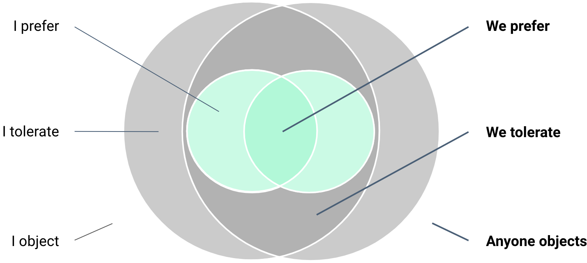

# Assenso

L'assenso è un determinato [metodo decisionale](metodo-decisionale.md) che implica che in un gruppo ci sia assenza di obiezioni.

Si raggiunge attraverso il **non disaccordo** rispetto ad una decisione da prendere in un gruppo.

<figure><figcaption>
Assenso e Consenso - CC BY SA  - The Hum
</figcaption></figure>

In questa immagine - realizzata da [The Hum](https://www.thehum.org/) per il workshop[ Patterns for Decentralised Organising](https://drive.google.com/file/d/1wI818VXLVMnH1be1MzaztGpxC457KlX3/view) - si vedere la differenza fra assenso e consenso. Il “we prefer” è l’espressione di [consenso](consenso.md), il “we tolerate” è l’espressione dell’assenso. Al di fuori di questo ci sono le obiezioni.

\
Per maggiori informazioni sull'assenso e il suo funzionamento c’è un [articolo in italiano molto dettagliato](https://www.sociocracyforall.org/it/sociocrazia/decidere-assenso/) su Sociocracy for All.
